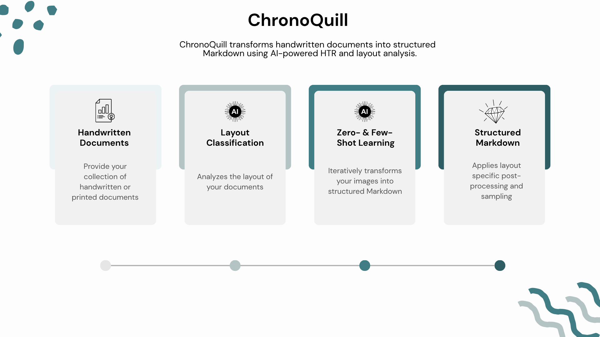

# ChronoQuill

ChronoQuill's transformation pipeline leverages AI-powered HTR, layout classification, and few-shot learning to convert handwritten documents into structured Markdown. The indexing model is [here](https://huggingface.co/eth-library/QuillIndex) on Hugging Face. For more technical details, access the working paper [here](https://www.research-collection.ethz.ch/server/api/core/bitstreams/8053d4d8-51b4-4103-8164-b5068ddb3903/content).

<div style="text-align: center;">  </div>

## Setup Instructions

```bash
git clone git@github.com:eth-library/ChronoQuill.git
cd ChronoQuill
```

### Environment and Libraries
```bash
uv venv chrono
source chrono/bin/activate

uv pip install torch torchvision --index-url https://download.pytorch.org/whl/cu128
uv pip install google-genai timm dotenv
```

### Environment Variables
Create a `.env` file in the project root and add your Gemini API key:
```
GEMINI_API_KEY=your_api_key_here
```

### Classifier & Few-Shot Samples
Download the classifier and GT samples:
```bash
./setup.sh
```

## Project Structure
- `chrono_quill.py` — Main pipeline script
- `utils.py` — Utility functions and helper classes
- `prompts.py` — System prompts for Gemini API
- `few_shot/` — Few-shot ground truth samples
- `models/` — Pretrained model files
- `data/` — Input and output data

## Transform TIFF & JPG into Markdown
```bash
python chrono_quill.py
```

## License
We release ChronoQuill under the Apache 2.0 license.

## References
- [Google GenAI](https://ai.google.dev/)
- [Swin Transformer: Hierarchical Vision Transformer using Shifted Windows](https://huggingface.co/timm/swin_large_patch4_window7_224.ms_in22k)

## Remarks
The pipeline is specialized to process ETH's school council protocols. For different use cases, consider pretraining your own classifier and provide suitable grount truth for few-shot learning.

## Citation
If you use this pipeline in your work, please cite:
```bash
@article{marbach2026closed,
  title={Closed-Vocabulary Multi-Label Indexing Pipeline for Historical Documents},
  author={Marbach, Jeremy},
  year={2026},
  publisher={ETH Zurich},
  url={https://www.research-collection.ethz.ch/server/api/core/bitstreams/8053d4d8-51b4-4103-8164-b5068ddb3903/content}
}
```